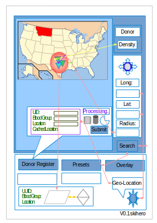

# esta12
esta12 
  This came up on a test and thought it was wonderful project to pull out a drawing pad.   I think it came out nice. The initial thought for a single page app to register donors and supply registry for emergency situations.  
I can already imagine a nice realtime blinking interface like in the movies. 
The disaster response teams in various location could use this and co-ordinate for a supply mission. 
 
Including it here for possible development.
What do you think? 

